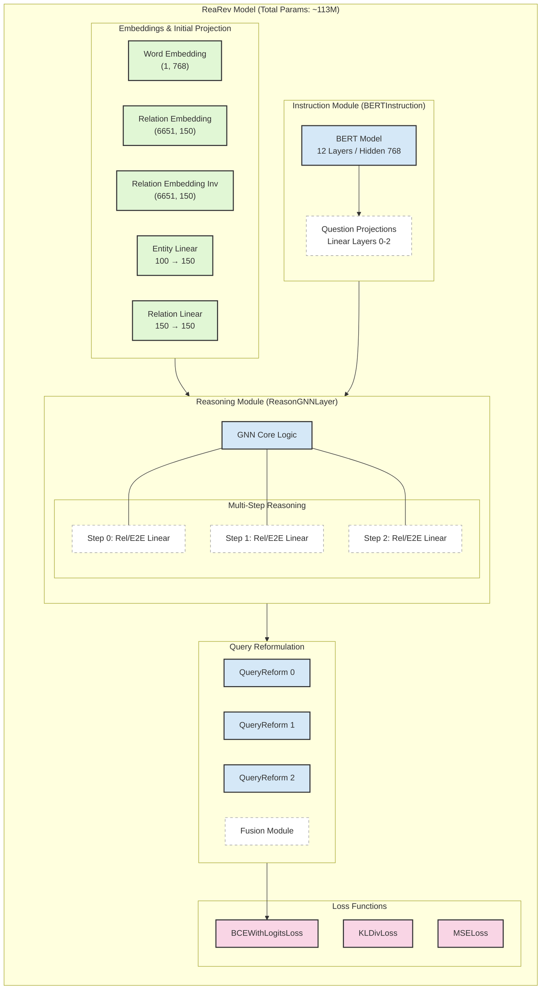

## Get Started
We have simple requirements in `requirements.txt`. You can always check if you can run the code immediately.

The datasets as well as the pretrained LM (LMsr) are uploaded here: hhttps://drive.google.com/drive/folders/1ifgVHQDnvFEunP9hmVYT07Y3rvcpIfQp?usp=sharing

Please download them and extract them to the corresponding folders.

## Training
Please follow the guidelines and hyperparamters of the corresponding GNNs for training. See `scripts` on a training example.  

Otherwise, you can download released GNN models from here: https://drive.google.com/file/d/1p7eLSsSKkZQxB32mT5lMsthVP6R_3x1j/view

## Evaluation

To evaluate them, copy the command from the above scripts, add the `--is_eval` argument, and `--load experiment` followed by the name of the corresponding `ckpt` model.

For example, for Webqsp run:
```
python main.py ReaRev --entity_dim 50 --num_epoch 200 --batch_size 8 --eval_every 2 --data_folder data/webqsp/ --lm sbert --num_iter 3 --num_ins 2 --num_gnn 3 --relation_word_emb True --load_experiment ReaRev_webqsp.ckpt --is_eval --name webqsp
```

The result is saved as a `.info` file. In order to use GNN-RAG, please move this file to the corresponding folder in `GNN-RAG/llm/results/gnn/` by renaming it to `test.info`.

## Subgraph Denoising (optional)
You can enable subgraph denoising during data loading to prune noisy edges:
```
python main.py ReaRev --data_folder data/webqsp/ --lm sbert --enable_denoise true --encoder_type tfidf --topM_strict 10 --topK_strict 50 --gamma_strict 0.2 --min_edges 50
```
If you have relation descriptions or relation-pair stats, provide them via:
```
--relation_desc_path path/to/relation_desc.json --enable_pair_score true --pair_stats_path path/to/pair_stats.json
```
Sanity check on one example:
```
python scripts/denoise_sanity.py --data_folder data/webqsp/ --split dev --sample_idx 0 --enable_denoise true
```



